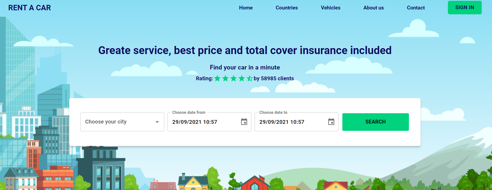
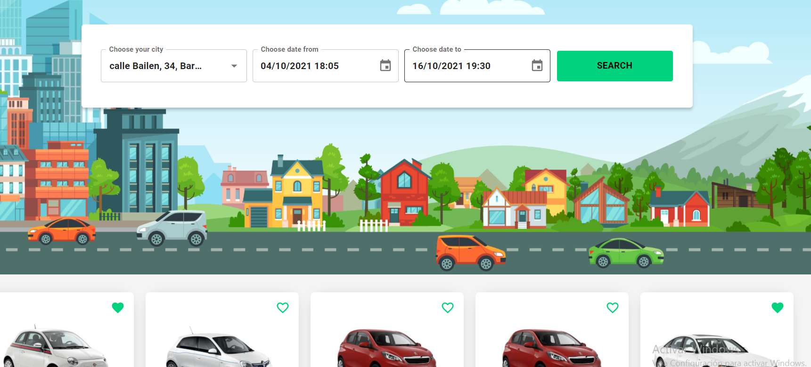
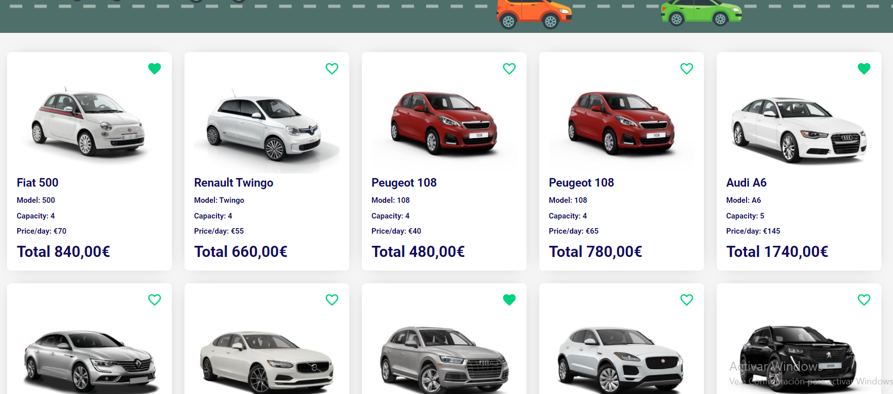

# RENT A CAR

### Project description
This project was developed as technical challenge. Rent a car is an
application that allows you to check available cars depending on choosen location and days. Also, as a result you'll find a car model, picture, car description, price/day and total renting price. 

### Tecnologies
- JavaScript (ES6)
- Webpack
- React
- Redux
- SASS
- PostCSS
- Babel
- Material UI

### Set up 
1. Clone this repo
2. Install dependencies
```
npm install or yarn install
```
3. Run project
```
npm start or yarn start
```
### Running tests
```
npm run test
```
### Build (if needed)
```
npm run build
```
## Product






### Tests

